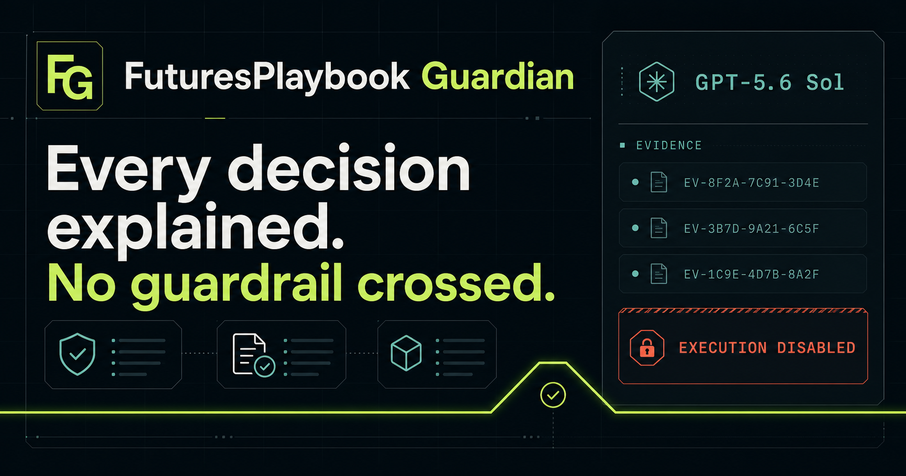

# FuturesPlaybook Guardian

**Every decision explained. No guardrail crossed.**

FuturesPlaybook Guardian is a read-only incident explainer for controlled capital-markets workflows. A deterministic validator makes every approve, review, or reject decision. GPT-5.6 Sol receives only a sanitized replay bundle, explains the decision with evidence IDs, identifies uncertainty, and proposes a regression test. It cannot approve a workflow, change a limit, or execute an action.

Built for the OpenAI Build Week hackathon, Developer Tools track.



## Why it matters

Operational teams often have logs and controls but no fast, trustworthy explanation of *why* a workflow stopped. Guardian turns an audit trail into a concise incident brief while keeping authority in deterministic code and human approval gates.

The demo makes the boundary visible:

- deterministic Python rules remain authoritative;
- GPT-5.6 Sol is restricted to explanation and test recommendation;
- structured output must cite supplied event or decision IDs;
- `execution_authorized` can only be `false`;
- the adapter stays in dry-run mode and the UI permanently shows execution disabled.

## Run the replay demo

Python 3.11 or newer is required. The default command uses verified fixtures, so no API key is needed.

```bash
python -m venv .venv
source .venv/bin/activate
python -m pip install -e ".[dev]"
PYTHONPATH=src python examples/run_guardian_demo.py --scenario limit-breach
```

Available scenarios are `limit-breach`, `approval-drift`, and `thin-evidence`.

To exercise the real Responses API, set the key in your shell—never commit or paste it into the application—and add `--live`:

```bash
export OPENAI_API_KEY="your-key"
PYTHONPATH=src python examples/run_guardian_demo.py --scenario limit-breach --live
```

The live path defaults to `gpt-5.6-sol`, medium reasoning, strict JSON-schema output, and `store: false`. Override `OPENAI_MODEL` only when intentionally testing another compatible model.

## Run the control room

```bash
cd web
npm install
npm run dev
```

Open `http://localhost:3000`. The dashboard works without credentials using the three deterministic replay briefs. For a local live explanation, copy `web/.env.example` to `web/.env.local`, set the key, and explicitly set `ENABLE_LIVE_AI=true`.

## Architecture

```text
sanitized JSONL replay
  -> deterministic rule engine
  -> safety + manual-approval gates
  -> audit bundle (allowlisted fields only)
  -> GPT-5.6 Sol structured explanation
  -> evidence-backed incident brief

execution path: permanently disabled in this edition
```

Key files:

- `src/workflow_automation/guardian.py` builds the allowlisted AI bundle and offline briefs.
- `src/workflow_automation/ai_explainer.py` implements the Responses API contract.
- `examples/run_guardian_demo.py` runs all three replay scenarios.
- `web/` contains the interactive hackathon control room.
- `evals/guardian_cases.jsonl` records the judge-visible safety expectations.
- `docs/hackathon.md` contains the submission copy and three-minute demo script.

## Verification

```bash
pytest -q
cd web && npm test
```

The suite checks the original workflow validator, the permanent execution boundary, the strict Sol request shape, all replay expectations, and the rendered dashboard.

## Safety and scope

This public repository contains sanitized synthetic events only. It excludes strategy logic, credentials, account details, production endpoints, and live execution code. It is an educational workflow-observability demonstration, not trading or investment advice.

## Built with OpenAI

GPT-5.6 Sol powers the bounded incident-explanation step through the Responses API. Codex was used to turn the underlying validator into the hackathon edition, add adversarial safety tests, create the interface, and document the review path. Human review remains required for every state-changing decision.

## License

MIT. See [LICENSE](LICENSE).
